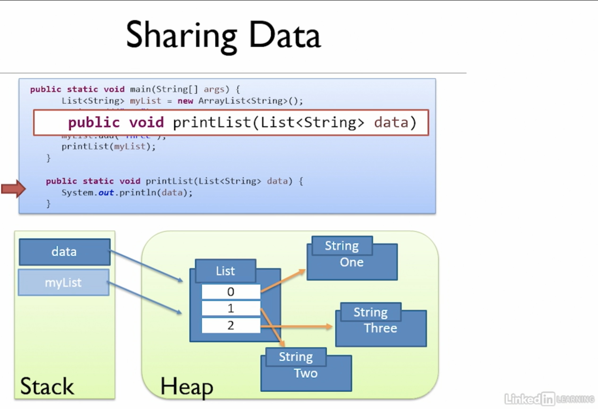

# Java Memory Management
Learning from the course: [Java Memory Management](https://www.linkedin.com/learning-login/share?forceAccount=false&redirect=https%3A%2F%2Fwww.linkedin.com%2Flearning%2Fjava-memory-management%3Ftrk%3Dshare_ent_url)

## Some Learning Notes ##

### JVM Stack and Heap ###
* Heap is like a huge area for storing data. 
* Can think of the heap being all the memory for the application except for the data on the stack. 
* In an application there is one heap which is shared across all threads, and a number of stacks, one for each thread. 
As shown below.  

* Heap is a large amount of memory space compared to stacks.
* Heap makes it easy to pass objects around threads or code blocks. 

&nbsp;

* **All objects are stored on the heap.**
* **Stacks store local primitive variables, and object references.**

&nbsp;

### Code walkthrough ###

&nbsp;

### Pass by Value ###
* values are copied when passing into functions. 
* object references are copied when passing into functions. 
* The `final` keyword:   
  * **variable can only be assigned once**. 
  * once it has been assigned, it cannot be altered. 
* The can and cannot of `final`: 
  * Can change value from uninitialised to having a value. 
  * Can change state of object. 
  * Cannot reassign.

&nbsp;

### Escaping References with collections ###
* This happens when we have methods that return pointer to the internal object.   
  In this case, getCustomers() that returns private records.
* Solution 1: Make internal object Iterable. 
  * Issue: remove() method of iterator, which still mutates.
* Solution 2: Return a copy of the internal object. 
  * Issue: Still can mutate the underlying object of the original collection. 
  * As the copy is a shallow copy. 
  * also, cause confusion: ppl may think we are dealing with the original copy. 
* Solution 3: Return immutable collections: `unmodifyableMap`, `unmodifyableList`. 

&nbsp;

### Escaping References by returning copy of custom object ###
* However, this can be confusing as client may think he is changing the original copy. 

&nbsp;

### Escaping References by returning a read-only version ###
* Interface that only has getter methods.

&nbsp;

&nbsp;
----
### Useful links ###
* [Copying a HashMap in Java](https://www.baeldung.com/java-copy-hashmap)

