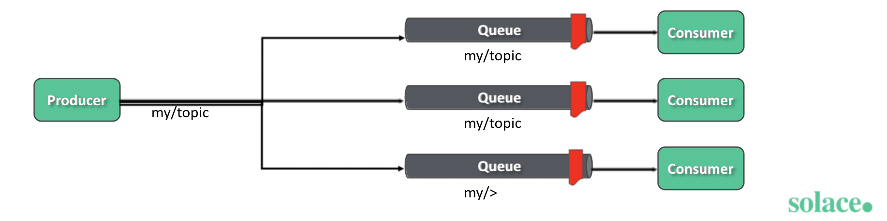

#  Solace Java

## Some Learning Notes ##

### Steps to start ###
1. Follow [this](https://solace.com/products/event-broker/software/getting-started/) to start solace broker in Docker. 
2. I used "PubSub+ Event Broker: Software". 
3. Start broker and develop clients to connect to broker using the api's

&nbsp;

### Message ###
* 3 types of messages: 
  1. An event is a notification of change of state. 
  2. A query is a message that retrieves information (for example, HTTP GET and HEAD methods).
  3. A command instructs another application to do perform an action or change a state. 
* 3 types of messages and corresponding messaging models: 
  1. event: publish / subscribe
  2. query: point-to-point or request-reply
  3. command: point-to-point or request-reply
* Messages contain events/queries/commands in the body. 
* Events are visible to a person or business.   
  Messages are visible at the transport level. 
* Event messages are routed from producers to consumers by an Event Broker.

&nbsp;

### The idea about loose coupling ###
* Producers don't know consumers. 
* Consumers don't need to know producers. 
* Producers and consumers can be in different platforms with different languages. 
* Loose coupling does not mean no coupling:   
  They still need to follow certain contract/schema

&nbsp;

### Topics VS Queues ### 
* Topics:   
  1-to-many  
  pub-sub
* Queue:  
  1-to-1
  point-to-point

* Topics support **hierarchical naming scheme**, like directory structure.
* example topic: myHome/livingroom/temperature
* Consumers can subscribe to multiple topics at once using wildcard:   
  myHome/>
  myHome/ivingroom/*

* Queues do not have hierarchy. 
* Queues ensure only 1 receiver consumes any given event. Can have multiple receivers, 
but only 1 can successfully consume an event.  
* Provides **persistence** for events. They are not lost if **broker or consumer crash**.   
  Producers receive ack from **broker** when evenr is persisted into queue. 
  Consumers send ack to **broker** after consuming the event, and event is removed from queue. 
  Note the loose coupling over here. 

&nbsp;

### Client of broker ###
* An application that sends or receives an event from is a **client of the broker**, or client. 
* Yes, a client can be producer or consumer, publisher or subscriber. 

&nbsp;

### Quality of Service and Delivery Modes ###
* QoS determines if an event should be transmitted reliably or not.  
* Direct delivery: less reliable, for high throughput and low latency scenarios, may miss some events 
* Guaranteed delivery: 0 message loss, 

* Direct delivery: fire and forget, no ack, no storage of msgs in broker. 
* Guaranteed delivery: stores msgs in disk of broker. Only deletes msgs after receiving ask from consumer.  
  Note that producer does not reveive ack regarding if event has been consumed.  
  It only receives ack regarding if event is stored in broker's disk. 
  If disk is full, broker sends negative ack, producer decides if it wants to republish or not.   
  Store-and-forward : broker stores the event first, guaranteeing that it will be forwarded to subscribers. 

* To use guaranteed delivery, broker needs to be cofigured with disk of storage. 
* To achieve pub-sub with guaranteed delivery:  
  Apps publish events to topics, and topics are mapped to queues to persist the events. 

&nbsp;

### Topic Structure and Wildcards ###
* Max length of topic is 250 bytes. 
* The length could have impact on network efficiency. 
* Topics are case-sensitive. 
* Each "/.../" is a level. 
* **Wildcards are mainly used for consumers.**  
  **If producers publish to topics with wildcards, that will result in the wildcard being interpreted as a literal character.**
* `*` wildcard is used to **match 0 or more characters within a singe level**.   
  
* `>` wildcard is used to **match 1 or more levels at the end of the topic**.   
  
* Topic design guidelines: 
  * Use consistent case within a level. 
  * Use abbreviations to reduce length of topic. 
  * Minimise use of special symbols. For readability and minimising typos.   
    But exception is to use underscore for spaces. 

&nbsp;

### Message VPN ###
* Enables sharing of single event broker.
* Allows for data separation and resource partitioning. 
* Different developers can share same event broker with the same settings, but still have data separations. 

&nbsp;

### Creating Queues and Mapping Topics to Queues ### 
* Queues need to be created first before we can publish to and consume from it. 
* Several queues can be mapped to the same topic subscriptions.   
  Queue -> Subscription -> Add subscription

&nbsp;

### More Notes on basic concepts ###
* Publish-Subscribe: messages are processed multiple times by different consumers.
* Point-to-Point: messages are processed by a single Consumer. 
* Request-Reply: two-way communication using separate point-to-point channels. 
* A message VPN allows for the segregation of topic space and clients. 
* Applications or devices that connect to event brokers are represented as clients.
* A client corresponds to a single logical connection to the event broker   
  that is capable of **sending and/or receiving** messages. 
* Client Names are unique within a given Message VPN. 
* Direct messages use case: https://docs.solace.com/Basics/Direct-Messages.htm 
* Guaranteed messages: https://docs.solace.com/Basics/Guaranteed-Messages.htm

&nbsp;

### Messages and SMF ###
* Solace PubSub+ uses the Solace Message Format (SMF) protocol for client and event broker communications.
* SMF uses a proprietary binary message format that   
  provides an efficient method of **encapsulating messages for transmission over the platform**. 
* Messages produced by one Solace API can be understood by any other consuming Solace API. 

&nbsp;

### API's ###
* Solace Messaging APIs: Java, JCSMP ... 
* Open APIs: JMS

&nbsp;

### Connection to cloud ### 
* [Landing page](https://console.solace.cloud/)
* To retrieve the connection credentials:   
  "Cluster Manager" -> "vpn" -> "connect"

&nbsp;

&nbsp;
----
### Useful links ###
* [solace-samples-java](https://github.com/SolaceSamples/solace-samples-java/blob/main/src/main/java/com/solace/samples/java/HelloWorld.java)
* [SMF vs JMS](https://docs.solace.com/ConceptMaps/Component-Maps.htm#Differen)
* [Java API](https://docs.solace.com/Solace-PubSub-Messaging-APIs/Java-API/java-api-home.htm)
* [JCSMP API](https://docs.solace.com/Solace-PubSub-Messaging-APIs/JCSMP-API/jcsmp-api-home.htm)
* [Direct Messaging VS Guaranteed](https://docs.solace.com/Solace-PubSub-Messaging-APIs/API-Developer-Guide/Message-Delivery-Modes.htm)
